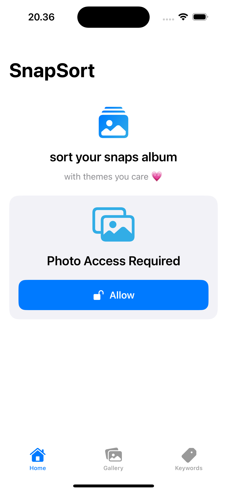
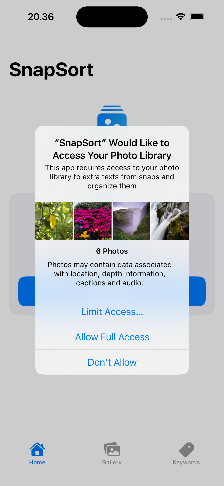
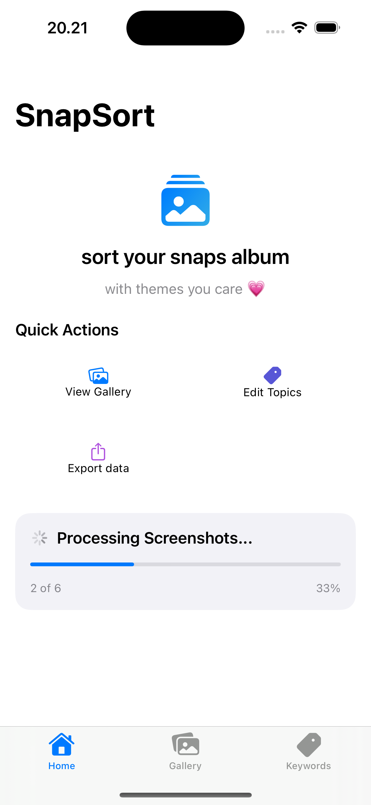
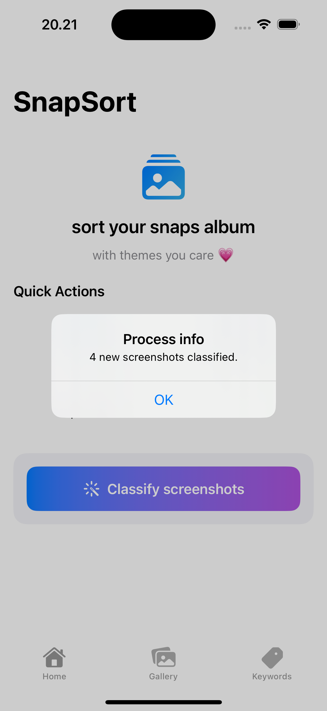
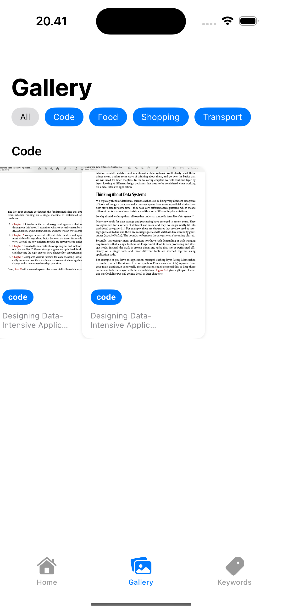
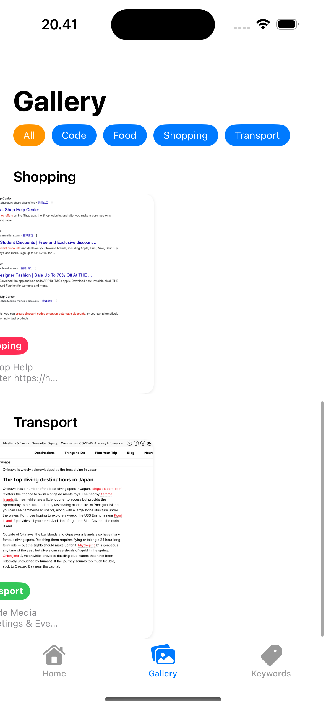
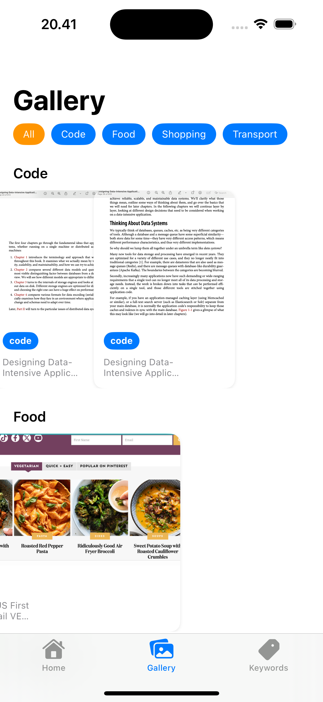
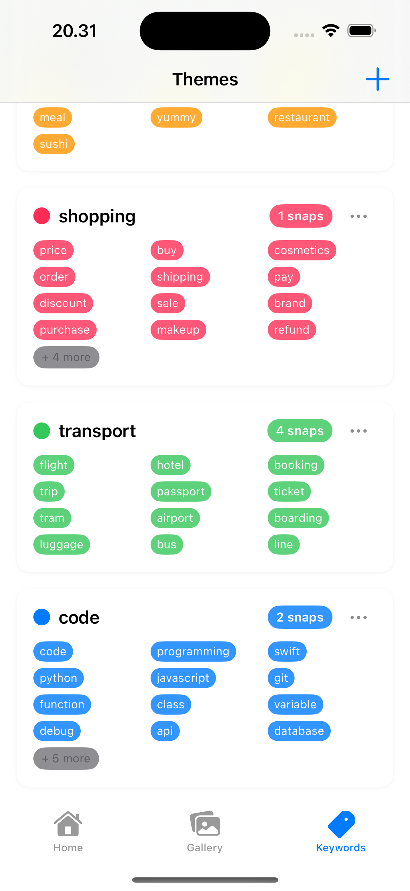
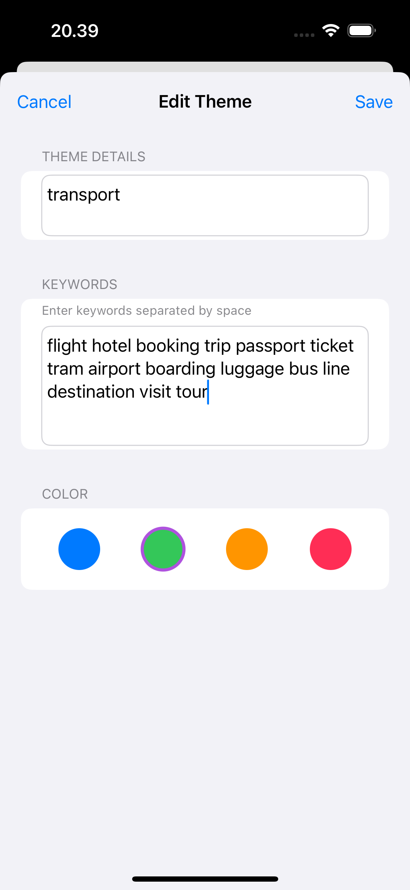
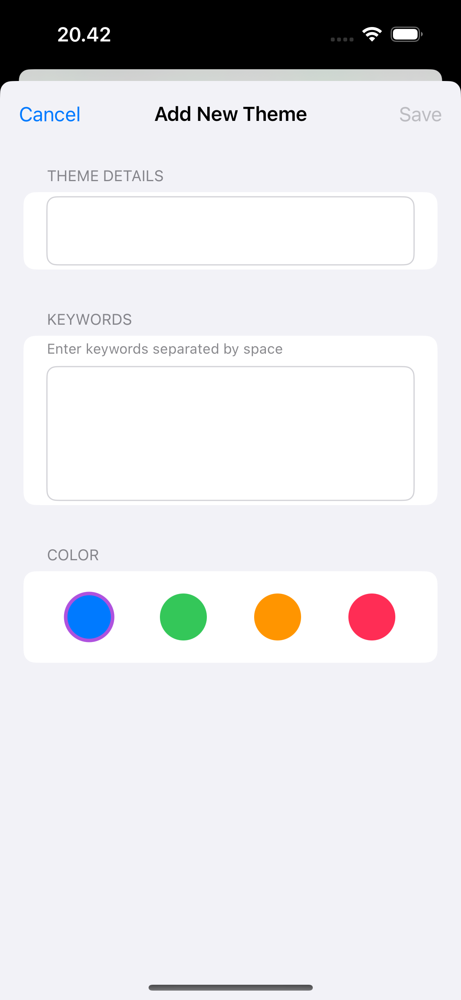

# Snapsort

Snapsort is an ios App that access your screenshots in your album (under user consent) and automatically sort them based on themes from the extracted text.

## 📦 Installation

### Requirements

- macOS with Xcode (version >= 14.0)
- iOS Simulator (comes with Xcode)
- run the app on a real device or simulator

### 🧪 _Run in Simulator (No Signing Required)_

1. Clone the repository:

```bash
git clone https://github.com/LycheeeLu/SnapSort.git
cd SnapSor
```

2. Open the Xcode project:

```bash
open SnapSort.xcodeproj
```
3. In Xcode:

- Select a Simulator (e.g. iPhone 15 Pro) from the device list near the top.

- Do not choose “Any iOS Device (arm64)”, or you will get a code signing error.

- Go to Signing & Capabilities → Uncheck “Automatically manage signing”.

- Set Team to “None” if prompted.


## 🛠 Built With

- **Swift**   
- **Xcode** 
- **Swift UI and SwiftData**  
- **Machine Learning & Apple's Vision Framework (optical character recognition (OCR))** 
- **Local Storage** 


## 🖼 Feature
 
- Provides default themes (e.g., Travel, Notes, Code, Shopping, Work) to categorize your screenshots

- Browse, edit theme/topic keywords, and customize color tags to define how you want your screenshots to be sorted
- Designed to be lightweight and fast


## 🪄 Usage

### _1. Give permission to access photo library_
### _2. Click categorization button_




### _3. View full or theme-based sorted snaps gallery_



### _4. Edit existing Themes with more topic keywords_
### _5. Or add more Themes of intersts_



